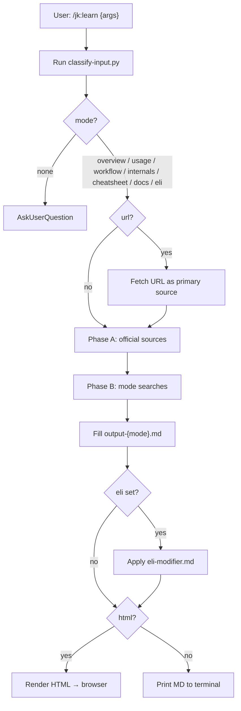

# /jk:learn — Structured Learning

Learn a topic with one command. Each mode answers exactly one learning question, researches only what that question needs, and uses its own template.

## Modes

| Mode | Answers | Contains | Output |
|------|---------|----------|--------|
| **overview** (default) | What is it, and should I use it? | Definition, core concepts, when to use / not, comparison with alternatives. No code. | MD terminal |
| **usage** | How do I use it? | Setup, use cases with runnable code, common patterns | HTML browser |
| **workflow** | How do I get one real task done, end to end? | Goal, ordered steps each with a check, end-to-end verification, common failures | HTML browser |
| **internals** | How does it work inside? | Mental model, architecture, execution flow, design trade-offs, pitfalls with causes, performance | HTML browser |
| **cheatsheet** | Where is that API / option again? | Quick start, API and config tables, one-line pitfalls. No prose. | HTML browser |
| **docs** | What should I read in the official docs, and in what order? | Verified official links, reading order, what to skip, docs pitfalls. No content summary. | MD terminal |

A suggested learning path is `overview` → `usage` → `workflow` → `internals`, with `cheatsheet` and `docs` kept for lookup and further reading.

**Mode word**: the first word, exactly as named above. There are no aliases; any other first word is part of the topic.

**Flags** (anywhere in the input):

| Flag | Effect |
|------|--------|
| `--eli<N>` | Reader level modifier, N = 1-99 ("explain like I'm N"). Works with every mode. Without a mode word, it selects the dedicated beginner template (`mode: eli`). |
| `--html` | Force HTML output |
| `--md` | Force MD terminal output |

## Dependencies & Fallback

`jk:learn` is **standalone**: it works with built-in tools only. Companion skills from claudekit/AgentKit are used when available for richer output, and each has a built-in fallback.

| Capability | Preferred (if registered in runtime) | Fallback (always available) |
|---|---|---|
| Official docs fetch | `/ak:docs-seeker` skill | `WebSearch` + `WebFetch(<official-doc-url>)` |
| URL → markdown | `mcp__web_reader__webReader` MCP tool | `WebFetch(<url>)` |
| MD → HTML render | `scripts/render-learn-html.py` (built in, always tried first); `html-anything` skill only with `--eli<N>` or when the script fails | Print MD to the terminal |
| Mermaid syntax reference | `ak:mermaidjs-v11` skill | https://mermaid.js.org/intro/ |
| Visual analysis | `ai-multimodal` skill | Skip (optional; only when visual context adds value) |
| Python (input classifier) | `~/.claude/skills/.venv/bin/python3` | `python3` (script is stdlib-only) |

**Detection rule:** before invoking a preferred capability, check whether that skill, slash command, or MCP tool is registered in the current runtime. If not, use the fallback **silently**: do not error, warn, or ask the user. Never block on a missing companion skill.

## Process Flow



## Step 1: Classify Input

Run the classifier from this skill's folder:

```bash
# Script is stdlib-only (sys, re, json); any python3 works.
~/.claude/skills/.venv/bin/python3 scripts/classify-input.py "$ARGUMENTS" 2>/dev/null \
  || python3 scripts/classify-input.py "$ARGUMENTS"
```

> Resolve `scripts/classify-input.py` to an absolute path inside the directory that contains this SKILL.md before executing.

Output: `{mode, topic, html, url, eli}`. `eli` is the reader level N, or `null`.

If `mode: "none"`, use `AskUserQuestion` to ask what the user wants to learn.

## Step 2: Route

Load `references/input-routing.md` for the classifier rules, URL handling, and output format details.

| Mode | Phase B searches | Template |
|------|------------------|----------|
| overview | 1 | `references/output-overview.md` |
| usage | 2 | `references/output-usage.md` |
| workflow | 2 | `references/output-workflow.md` |
| internals | 2 | `references/output-internals.md` |
| cheatsheet | 1 | `references/output-cheatsheet.md` |
| docs | 1 | `references/output-docs.md` |
| eli | 1 | `references/output-eli.md` |

When `eli` is not null, also load `references/eli-modifier.md`.

## Step 3: Research

Load `references/research-strategy.md`.

1. **Phase A**: official sources: the `docs-seeker` skill if registered, else `WebSearch` + `WebFetch` (see Dependencies & Fallback).
2. **Phase B**: the mode's searches, in parallel.
3. **Phase C**: synthesize only what the mode's template asks for.

## Step 4: Generate Output

Fill the template exactly, section by section. Load `references/visuals.md` for the mode's diagrams: Mermaid when `html: true`, ASCII when `html: false`. Respect its "Not in This Mode" list: content that belongs to another mode is left out and pointed to in "Next Steps".

**Concept topics** (TCP, DNS, event loop, a design pattern) have no package to install. Replace library-only fields (bundle size, install command, API signatures) with what fits the concept (variants, standards, where it runs), or drop them. Never invent data to complete a table.

**Output language**: follow the language rules in the user's CLAUDE.md; if there are none, use the language the user writes in. Translate the template headings into that language. Keep code, identifiers, and commands unchanged, and write code comments in English.

## Step 5: Output Format

If `html: true` (usage, workflow, internals, cheatsheet, or `--html`):
1. Write the full MD content to a temporary file (outside the user's project).
2. Pick the renderer:

   | Condition | Renderer |
   |-----------|----------|
   | `eli` is null | `scripts/render-learn-html.py` (default: deterministic, near-instant) |
   | `eli` is set | `html-anything` skill with its `teaching` style, if registered; else the script |
   | Script exits non-zero | `html-anything` skill as fallback, if registered |
   | Neither renderer works | Print the MD to the terminal and say HTML rendering failed |

   ```bash
   python3 scripts/render-learn-html.py --in <note.md> --out ./{topic-slug}-learn.html \
     --mode <mode> --lang <output-language-code> --open
   ```
3. Save to the **current working directory** as `./{topic-slug}-learn.html`, unless the user gives a path.
4. Open it in the browser (`--open` does this for the script).
5. Do not print the raw MD to the terminal.

If `html: false` (overview, docs, eli, or `--md`): print the MD content to the terminal.

## Related Skills

Optional, from claudekit/AgentKit, each with a built-in fallback (see Dependencies & Fallback):
- `docs-seeker`: fetches official documentation
- `html-anything`: richer HTML for `--eli<N>`, and fallback renderer
- `mermaidjs-v11`: Mermaid syntax reference
- `ai-multimodal`: supplements with visual analysis when useful
